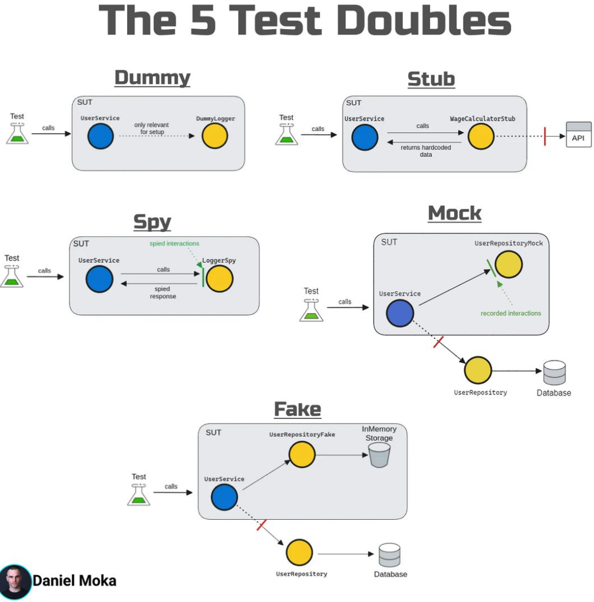
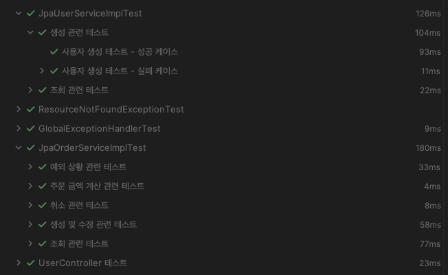

# 2. HOW - 테스트 코드를 어떻게 작성해야 하는가?

## 2.1 테스트 케이스 선택 방법

- **첫 번째 테스트의 중요성**: 구현하기 가장 쉬운 테스트부터 시작하는 것이 좋습니다. 예외적인 상황이나 가장 빠르게 개발할 수 있는 테스트 케이스를 먼저 작성하고, 점차 확장해 나갑니다.
- **점진적 확장**: 쉬운 테스트부터 시작해 점차 복잡한 테스트로 나아가면서 시스템의 안정성을 검증합니다.

## 2.2 TDD (Test-Driven Development) 방법론

TDD는 테스트 주도 개발 방식으로, 테스트 코드를 먼저 작성하고 이를 기반으로 프로덕션 코드를 작성하는 방식입니다. TDD는 다음과 같은 세 단계를 따릅니다:

1. **레드 단계**: 실패하는 테스트를 작성합니다. 이때, 아직 프로덕션 코드는 작성되지 않았기 때문에 테스트는 실패합니다.
2. **그린 단계**: 최소한의 코드로 테스트를 통과시킵니다. 테스트를 성공시키기 위한 코드만 작성하여 빠르게 테스트를 통과합니다.
3. **리팩터 단계**: 중복을 제거하고 코드 구조를 개선합니다. 테스트가 통과한 후 코드의 가독성이나 유지보수성을 높이기 위해 리팩터링을 진행합니다.

이 과정을 반복하면서 점진적으로 시스템을 구축하고 테스트의 커버리지를 높여갑니다.

## 2.3 다양한 테스트 종류와 계층 구조 이해

- **단위 테스트**: 개별 모듈이나 메서드를 테스트하는 방식으로, 가장 기본적인 테스트 방법입니다. 빠르고, 독립적으로 실행될 수 있습니다.
- **통합 테스트**: 여러 모듈이 함께 작동하는지를 테스트하는 방식입니다. 단위 테스트보다 더 복잡한 시나리오를 검증할 수 있습니다.
- **시스템 테스트**: 전체 시스템이 의도한 대로 작동하는지를 검증하는 테스트로, 사용자의 관점에서 테스트를 진행합니다.

## 2.4 JUnit5 활용

JUnit5는 자바 테스트를 위한 표준 프레임워크입니다. 다음과 같은 주요 구성 요소와 기능을 갖추고 있습니다:

- **주요 어노테이션**
    - `@Test`: 테스트 메서드를 나타냅니다.
    - `@BeforeAll`, `@BeforeEach`: 각각 전체 테스트 전, 개별 테스트 전 실행될 메서드를 정의합니다.
    - `@AfterEach`, `@AfterAll`: 각각 개별 테스트 후, 전체 테스트 후 실행될 메서드를 정의합니다.
- **주요 어서션 메서드**
    - `assertEquals(expected, actual)`: 기대값과 실제값이 일치하는지 확인합니다.
    - `assertNull(object)`: 객체가 null인지 검증합니다.
    - `assertThrows()`: 예외가 발생하는지 검증합니다.

참조 코드: [JUnit 기본 테스트 예시 - UserServiceImplTest](https://github.com/junhkang/springboot-testing-from-zero-to-hero/blob/main/src/test/java/io/github/junhkang/springboottesting/service/impl/JpaUserServiceImplTest.java)

## 2.5 Mockito와 같은 Mocking 프레임워크 사용

Mocking은 외부 의존성을 모방하여 테스트하는 방법입니다. `Mockito`와 같은 프레임워크를 사용하여 쉽게 Mock 객체를 생성하고 테스트할 수 있습니다.

- **테스트 더블의 종류**
    - **Dummy**: 사용되지 않는 매개변수에 전달되는 객체입니다.
    - **Stub**: 미리 정의된 결과를 반환하는 객체입니다.
    - **Mock**: 동작을 검증할 수 있는 객체로, 메서드 호출 여부 등을 검증합니다.
    - **Spy**: 실제 객체의 동작을 일부 모니터링하거나 수정하는 객체입니다.
    - **Fake**: 실제 동작을 구현하지만, 단순하게 동작하는 테스트 객체입니다.

참조 코드: [Mockito를 활용한 UserControllerTest에서 Mock 객체 활용 예시](https://github.com/junhkang/springboot-testing-from-zero-to-hero/blob/main/src/test/java/io/github/junhkang/springboottesting/controller/UserControllerTest.java)

이미지 출처: [linkedin : Daniel Moka](https://www.linkedin.com/posts/danielmoka_mocks-are-one-of-the-most-misunderstood-and-activity-7241327748164571136-hGZn/?utm_source=share&utm_medium=member_ios)

## 2.6 다양한 테스트 어노테이션 및 도구 활용

- **@ParameterizedTest**: 여러 파라미터를 전달하여 같은 테스트를 반복 실행합니다. [참조코드](https://github.com/junhkang/springboot-testing-from-zero-to-hero/blob/main/src/test/java/io/github/junhkang/springboottesting/service/impl/JpaOrderServiceImplTest.java#L103)
    - `@ValueSource`: 다양한 값을 전달합니다.
    - `@EnumSource`: Enum 타입의 파라미터를 전달합니다.
    - `@MethodSource`: 메서드를 통해 테스트 데이터를 제공합니다.
- **@Nested**: 테스트를 그룹화하여 계층적으로 관리할 수 있습니다. [참조코드](https://github.com/junhkang/springboot-testing-from-zero-to-hero/blob/main/src/test/java/io/github/junhkang/springboottesting/service/impl/JpaOrderServiceImplTest.java#L81)
    - **Nested**를 사용하면 테스트를 논리적인 그룹으로 분리할 수 있으며, 이를 통해 **특정 도메인, 기능, 시나리오**에 대한 테스트를 더욱 체계적으로 관리할 수 있습니다. 특히, 여러 테스트 메서드를 계층적으로 정리하여 가독성을 높이고, 테스트 목적이 더 명확해지도록 도와줍니다.
- **@DisplayName**: 테스트의 설명을 추가하여 가독성을 높일 수 있습니다. [참조코드](https://github.com/junhkang/springboot-testing-from-zero-to-hero/blob/main/src/test/java/io/github/junhkang/springboottesting/service/impl/JpaOrderServiceImplTest.java#L82)
  - **DisplayName**을 통해 각 테스트 메서드에 대해 직관적인 설명을 부여할 수 있으며, 이는 테스트 결과 리포트에서도 그대로 반영되어 가독성을 크게 향상시킵니다. **테스트 트리**를 시각화할 때 각 테스트의 목적과 역할을 쉽게 이해할 수 있도록 도와줍니다.
- **@Timeout**: 테스트 실행 시간에 제한을 두어, 성능을 테스트할 수 있습니다. [참조코드](https://github.com/junhkang/springboot-testing-from-zero-to-hero/blob/main/src/test/java/io/github/junhkang/springboottesting/service/impl/JpaOrderServiceImplTest.java#L236)
- **@RepeatedTest**: 동일한 테스트를 여러 번 반복 실행합니다. [참조코드](https://github.com/junhkang/springboot-testing-from-zero-to-hero/blob/main/src/test/java/io/github/junhkang/springboottesting/service/impl/JpaOrderServiceImplTest.java#L357)
  - **RepeatedTest**는 동일한 테스트를 여러 번 반복 실행하여, 특정 코드가 여러 실행 환경에서도 일관되게 동작하는지 확인하는 데 유용합니다. **성능 테스트**나 **동시성 이슈**를 확인할 때 자주 사용됩니다.
- **@SpringBootTest**: 전체 스프링 컨텍스트를 로드하여 통합 테스트를 수행합니다.
- **Testcontainers**: 컨테이너 환경을 활용하여 통합 테스트를 진행할 수 있습니다.

### 가독성 향상된 테스트 트리 예시

`@Nested`와 `@DisplayName`을 적절히 사용하면 아래와 같이 **가독성이 높은 테스트 트리**를 구성할 수 있습니다:

참조 코드: [SpringBootTest와 다양한 어노테이션 활용 예시 - OrderControllerTest](https://github.com/junhkang/springboot-testing-from-zero-to-hero/blob/main/src/test/java/io/github/junhkang/springboottesting/service/impl/JpaOrderServiceImplTest.java)

## 2.7 MockMvc와 WebTestClient를 사용한 웹 레이어 테스트

웹 레이어 테스트를 위해 `MockMvc`와 `WebTestClient`를 사용합니다.

- **MockMvc**: Spring MVC를 모킹하여 웹 애플리케이션의 HTTP 요청 및 응답을 테스트합니다.
- **WebTestClient**: WebFlux를 지원하는 비동기식 테스트 클라이언트로, 웹 애플리케이션의 반응형 동작을 검증할 수 있습니다.

참조 코드: [MockMvc를 사용한 Web Layer 테스트 예시 - UserControllerTest](https://github.com/junhkang/springboot-testing-from-zero-to-hero/blob/main/src/test/java/io/github/junhkang/springboottesting/controller/UserControllerTest.java)