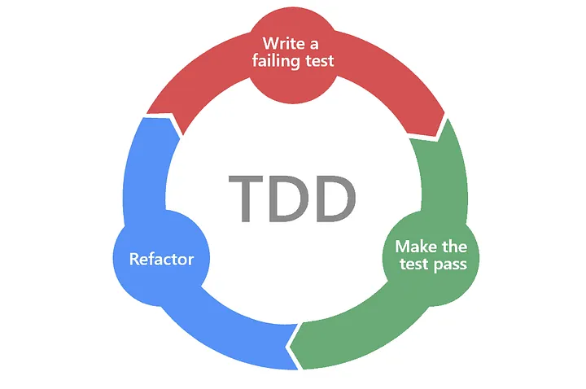
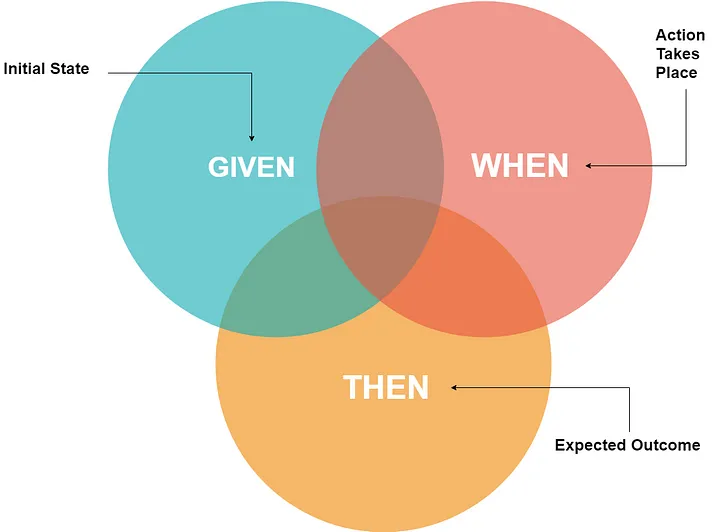

# 3. WHEN - 언제 테스트 코드를 적용해야 하는가?

## 3.1 TDD와 BDD의 개념 및 적용 시점

- **TDD (Test-Driven Development)**: TDD는 테스트를 먼저 작성하고, 그 테스트를 통과할 수 있는 최소한의 코드를 작성하며 개발을 진행하는 방법론입니다. TDD는 테스트를 통해 명확한 요구사항을 확인하고 코드 품질을 보장하는 방법으로 활용됩니다.
    - **레드-그린-리팩터 사이클**: TDD의 기본 개발 사이클은 `레드 단계` (실패하는 테스트 작성) → `그린 단계` (테스트를 통과하기 위한 코드 작성) → `리팩터 단계` (코드 정리 및 최적화)로 이루어집니다.
    - **적용 시점**: 새로운 기능을 개발하거나 기존 코드를 리팩토링할 때, TDD를 통해 코드의 안정성과 유지보수성을 높일 수 있습니다.

이미지 출처: [Applying Test-Driven Development](https://medium.com/pilar-2020/applying-test-driven-development-6d6d3af186cb)

- **BDD (Behavior-Driven Development)**: BDD는 사용자의 관점에서 시스템의 동작(Behavior)을 기술하고, 그에 맞는 테스트를 작성하여 개발을 진행하는 방법론입니다. BDD는 테스트를 통해 요구사항을 명확히 하고, 기능적인 동작을 검증합니다.
    - **Given-When-Then 패턴**: BDD의 테스트는 `Given` (어떤 상황이 주어졌을 때), `When` (어떤 동작이 수행되었을 때), `Then` (그 결과로 어떤 일이 발생해야 한다)의 패턴을 따릅니다.
    - **적용 시점**: 새로운 요구사항이 정의될 때, BDD를 통해 고객의 요구사항을 명확히 이해하고 구현할 수 있습니다.

이미지 출처: [Writing Human-Readable Tests: A Guide to Effective BDD Practices](https://medium.com/@dineshrajdhanapathy/writing-human-readable-tests-a-guide-to-effective-bdd-practices-75a7ab7888bb)

## 3.2 기존 코드베이스에 테스트 추가하기

- **레거시 코드베이스에 테스트 추가 전략**: 기존 프로젝트에 테스트 코드를 추가할 때는 우선순위를 정하고, 주요 기능이나 자주 변경되는 코드부터 테스트를 작성하는 것이 중요합니다. 레거시 코드베이스에 테스트를 추가할 때 다음과 같은 전략을 사용할 수 있습니다.
    - **핵심 비즈니스 로직에 집중**: 테스트 작성의 우선순위는 핵심 기능, 주요 비즈니스 로직에 집중해야 합니다.
    - **테스트 가능성 개선**: 레거시 코드가 테스트하기 어렵다면, 코드의 모듈화 또는 의존성 분리(Dependency Injection) 등을 통해 테스트 가능성을 높이는 작업이 필요합니다.
    - **리팩토링 후 테스트 작성**: 테스트를 추가하기 전에, 코드가 너무 복잡하거나 결합도가 높다면 리팩토링을 먼저 진행한 후 테스트를 작성하는 것이 좋습니다.

## 3.3 새로운 기능 개발 시 테스트 작성 시점

- **프로덕션 코드보다 테스트 코드를 먼저 작성**: TDD 원칙에 따라 새로운 기능을 개발할 때, 테스트를 먼저 작성하고 그 테스트를 통과할 수 있는 최소한의 프로덕션 코드를 작성하는 방식입니다.
    - **테스트 우선 작성의 장점**: 테스트를 먼저 작성함으로써, 새로운 기능에 대한 요구사항을 명확히 정의하고, 코드 작성 전에 논리적인 오류를 미리 방지할 수 있습니다.
    - **테스트 코드 기반의 개발 흐름**: 테스트를 작성하고 그 결과에 따라 프로덕션 코드를 작성함으로써, 테스트 주도 개발 흐름을 유지할 수 있습니다.

## 3.4 리팩토링 시 테스트의 역할

- **기존 기능의 안정성 확보**: 리팩토링은 코드의 동작을 변경하지 않고 구조를 개선하는 작업입니다. 이 과정에서 테스트 코드는 기존 기능이 올바르게 동작하는지를 검증하는 역할을 합니다.
    - **리팩토링 후에도 테스트가 통과하는지 확인**: 리팩토링 후 기존 테스트가 모두 통과한다면, 기존 기능에 이상이 없음을 보장할 수 있습니다.
    - **테스트가 없는 리팩토링은 위험**: 리팩토링 전에 반드시 충분한 테스트 커버리지를 확보해야 하며, 그렇지 않으면 리팩토링 과정에서 의도치 않은 버그가 발생할 수 있습니다.

---

## 3.5 테스트 작성의 우선순위와 체크리스트

테스트 작성 시 고려해야 할 우선순위와 체크리스트는 다음과 같습니다.

- **핵심 로직 및 비즈니스 규칙**: 가장 중요한 비즈니스 로직에 대해 우선적으로 테스트를 작성해야 합니다. 주요 사용 사례, 경계값 처리, 예외 상황 등이 여기에 포함됩니다.
- **에러 및 예외 처리**: 예외 상황에 대한 테스트를 포함해야 합니다. 예외가 제대로 처리되고, 사용자가 오류를 이해할 수 있도록 명확한 메시지가 제공되는지 확인해야 합니다.
- **테스트 피라미드 접근**: 단위 테스트, 통합 테스트, 시스템 테스트 순으로 우선순위를 정하고, 테스트의 깊이와 범위를 결정해야 합니다.
