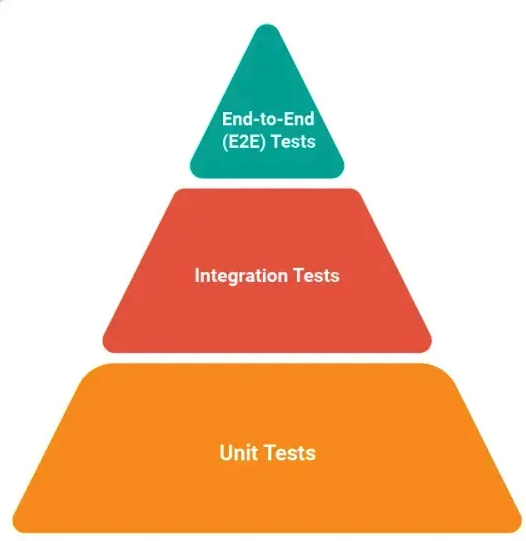
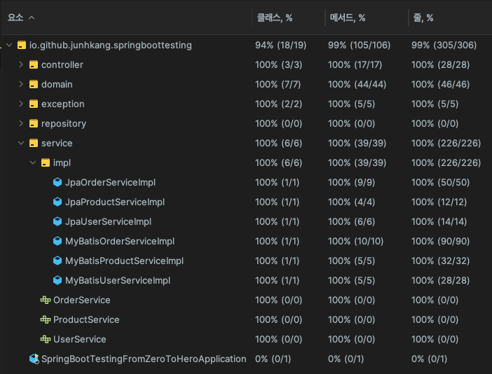

# 4. HOW DEEP - 얼마나 깊게 테스트 코드를 작성해야 하는가?

## 4.1 테스트 깊이를 결정하는 기준

테스트 깊이를 설정할 때는 다음과 같은 기준을 고려해야 합니다:

- **테스트 피라미드(Test Pyramid)**: 테스트 피라미드는 테스트 종류에 따른 계층 구조를 보여줍니다. 일반적으로 단위 테스트가 가장 많고, 그다음으로 통합 테스트, 시스템 또는 E2E(End-to-End) 테스트가 위치합니다.
    - **단위 테스트(Unit Tests)**: 가장 많은 비중을 차지하며, 작은 코드 단위를 독립적으로 테스트합니다.
    - **통합 테스트(Integration Tests)**: 여러 모듈이 상호작용하는지 테스트합니다.
    - **E2E 테스트(End-to-End Tests)**: 실제 사용자 관점에서 전체 시스템이 잘 작동하는지 확인합니다.

- **위험 기반 테스트(Risk-Based Testing)**: 비즈니스 중요도와 잠재적 위험 요소에 따라 테스트 우선순위를 설정합니다. 비즈니스에 중요한 기능이나 리스크가 높은 부분에 대한 테스트는 더 깊이 있게 수행합니다.

- **유스 케이스 기반 테스트**: 핵심 사용자 흐름과 엣지 케이스를 기반으로 테스트를 작성합니다. 실제로 사용자가 자주 사용하는 기능이나 예외적인 상황에서의 동작을 검증하는 것이 중요합니다.

- **현실적인 제약과 팀 역량 고려**: 모든 부분을 깊이 테스트하는 것은 시간과 리소스 측면에서 비효율적일 수 있습니다. 팀의 역량과 프로젝트 일정 등을 고려하여 테스트 깊이를 조정하는 것이 필요합니다.

이미지 출처: [Mastering the Test Pyramid](https://www.headspin.io/blog/the-testing-pyramid-simplified-for-one-and-all)

## 4.2 테스트 커버리지 및 품질 지표 활용

- **코드 커버리지**: 코드 커버리지는 테스트가 소스 코드의 얼마나 많은 부분을 실행하는지를 나타내는 지표입니다. 일반적으로 라인 커버리지(Line Coverage)와 브랜치 커버리지(Branch Coverage)를 측정합니다.
    - **라인 커버리지(Line Coverage)**: 테스트가 실행된 코드 라인의 비율.
    - **브랜치 커버리지(Branch Coverage)**: 분기문(예: if/else)의 각 분기를 테스트했는지 확인하는 비율.
    - 다음은 본 리포지토리 샘플 소스의 테스트 커버리지입니다.

- **커버리지 목표 설정**: 높은 커버리지는 중요하지만, 무조건 100% 커버리지를 목표로 하는 것은 오히려 비효율적일 수 있습니다. 핵심 비즈니스 로직이나 복잡한 부분에 집중하여 테스트 깊이를 설정하는 것이 중요합니다.

## 4.3 오버테스팅의 문제점

- **유지보수 비용 증가**: 불필요하게 많은 테스트는 유지보수 부담을 가중시킬 수 있습니다. 코드가 변경될 때마다 테스트도 함께 수정해야 할 수 있으며, 이는 오히려 생산성을 저해할 수 있습니다.
- **개발 속도 저하**: 모든 기능을 테스트하려다 보면 개발 속도가 느려질 수 있습니다. 핵심적인 부분에 집중하는 것이 효율적입니다.
- **리소스 낭비**: 지나치게 많은 테스트는 리소스를 낭비하게 만듭니다. 테스트를 효율적으로 유지하는 것이 중요합니다.

## 4.4 효율적인 테스트 범위 설정을 위한 체크리스트

- **핵심 로직에 대한 집중적인 테스트**:
    - 주요 비즈니스 로직을 검증합니다.
    - 경계 값 및 예외 상황을 철저히 테스트합니다.

- **주요 기능 및 사용자 시나리오 검증**:
    - 핵심 사용자 흐름을 테스트하여 애플리케이션의 주요 사용 시나리오가 올바르게 작동하는지 확인합니다.
    - 다양한 사용자 역할 및 권한에 따른 테스트를 수행합니다.

- **에러 및 예외 처리에 대한 테스트**:
    - 오류 메시지 및 예외 처리 로직을 검증합니다.
    - 인증 및 권한 부여와 관련된 로직에 대한 테스트를 강화합니다.

- **외부 시스템 및 통합 부분 테스트**:
    - API 연동 및 응답 처리에 대한 테스트를 포함합니다.
    - 데이터베이스 트랜잭션 일관성 검증 등을 고려합니다.

## 4.5 리팩토링과 테스트의 균형 잡기

- **필요한 부분에 집중하여 테스트 작성**: 모든 부분을 테스트하기보다는 중요한 부분에 집중하여 테스트합니다.
- **불필요하거나 중복된 테스트 코드 제거**: 리팩토링 과정에서 불필요하거나 중복된 테스트 코드는 제거해야 합니다.
- **테스트 코드의 유지보수성과 가독성 확보**: 테스트 코드도 프로덕션 코드처럼 유지보수성과 가독성을 확보해야 합니다.

